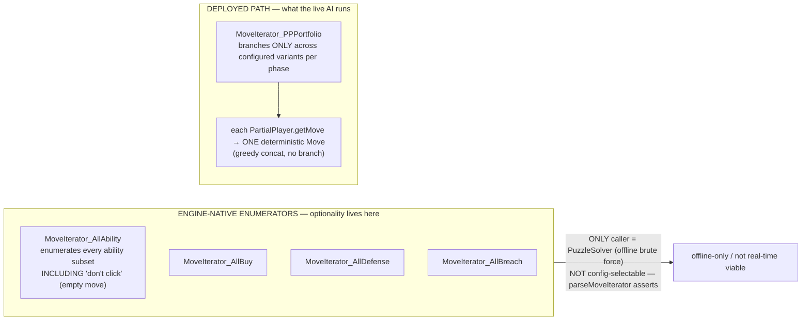
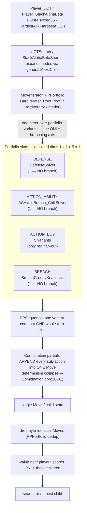
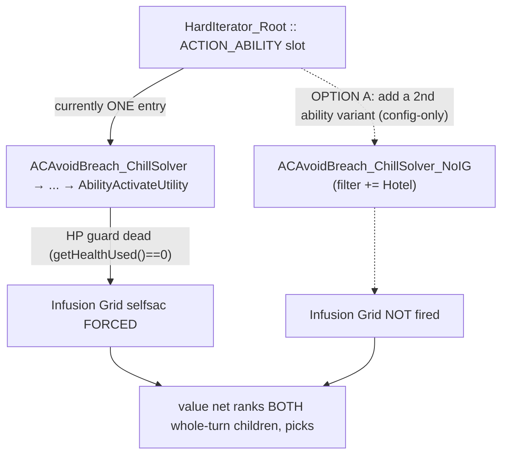

# RL Action-Space Map — dave-master Partial Players & Move Generation

> Date: 2026-06-02
> Engine: `dave-master-jsonclean` (engine_v1, the RL bring-up engine) at `c:/libraries/PrismataAI-dave-master/`
> Purpose: a complete, file:line-cited map of where the AI **collapses choice to a single deterministic line** vs. where it **branches**, so we can selectively widen the move-generation action space for reinforcement learning.
> All line refs below were re-verified against current dave-master source (prior recon numbers were spot-checked and corrected where noted).

---

## 0. The reframe (read this first)

The motivating bug — "the AI always self-sacs Infusion Grid" — is **not** a waste-rule problem and **not** something to fix with a guard that *prevents* the click. Sometimes selfsac'ing a 4-HP Infusion Grid into four 1-HP Houses is correct. The defect is that the AI has **no choice**: the click is *forced* whenever red is legal, so neither the search nor the value net ever gets to decide.

That makes Infusion Grid the canonical example of the real question:

> **Does this AI even have a mechanism to make a click *optional* — a candidate the evaluator chooses among?**

Short answer: **the engine has one, but the deployed AI does not use it, and it cannot be turned on by config.** The only practical optionality mechanism on the live path is **adding portfolio variants**. The rest of this doc proves that and maps every place choice is removed.

Two separate workstreams fall out, and they must not be conflated:

| Workstream | Nature | Status |
|---|---|---|
| Port `AvoidDefenseWaste` + `AvoidResourceWaste` into dave-master | **KEEP** work — removes provably-dominated moves (a gift to RL) | Still worth doing; needs a rebuild (blocked while engine is locked) |
| Make Infusion Grid (and Perforator red-split) **optional** | **OPEN** work — surfaces a non-dominated tradeoff to the evaluator | The subject of this map; first step is config-only |

---

## 1. The optionality answer — two move-generation families

The engine has **two** kinds of move generator, and the distinction *is* the answer:

**The contracts** ([MoveIterator.h:27-28](c:/libraries/PrismataAI-dave-master/source/ai/MoveIterator.h#L27-L28), [PartialPlayer.h:30](c:/libraries/PrismataAI-dave-master/source/ai/PartialPlayer.h#L30)):

- `MoveIterator::generateNextChild(child, move)` + `hasMoreMoves()` — a **generator**: yields a *set* of candidate children. Genuine branching.
- `PartialPlayer::getMove(state, move)` — produces **exactly one** deterministic move. No branching.

**The enumerators truly include "don't click."** `MoveIterator_AllAbility::recurse` is a per-card binary tree: for each isomorphic card-set it (a) activates and recurses, then (b) **unconditionally** `recurse(isoIndex + 1)` — the *skip this card* branch ([MoveIterator_AllAbility.cpp:143](c:/libraries/PrismataAI-dave-master/source/ai/MoveIterator_AllAbility.cpp#L143)). `reset()` even pushes the empty move = "activate nothing" as a candidate ([MoveIterator_AllAbility.cpp:214](c:/libraries/PrismataAI-dave-master/source/ai/MoveIterator_AllAbility.cpp#L214)). `IsomorphicCardSet` collapses symmetric units (N identical Drones → N+1 outcomes, not 2^N) via strict `Card::isIsomorphic` equality ([Card.cpp:864-873](c:/libraries/PrismataAI-dave-master/source/engine/Card.cpp#L864-L873)).

**But the enumerators are unreachable from config.** `AIParameters::parseMoveIterator` recognizes exactly one `type` string — `"PPPortfolio"` ([AIParameters.cpp:960](c:/libraries/PrismataAI-dave-master/source/ai/AIParameters.cpp#L960)); anything else asserts ([AIParameters.cpp:992](c:/libraries/PrismataAI-dave-master/source/ai/AIParameters.cpp#L992)). The only caller of `MoveIterator_All` in the codebase is `PuzzleSolver` (offline brute force). They also fully materialize + sort all candidates before yielding the first child — O(product) up front, exponential in distinct-type count — i.e. not a real-time UCT child generator. This is exactly why HardestAI uses the greedy portfolio instead.

**The law that governs everything below** ([UCTNode.cpp:62](c:/libraries/PrismataAI-dave-master/source/ai/UCTNode.cpp#L62), [StackAlphaBetaSearch.cpp:139](c:/libraries/PrismataAI-dave-master/source/ai/StackAlphaBetaSearch.cpp#L139), value applied at [UCTSearch.cpp:272](c:/libraries/PrismataAI-dave-master/source/ai/UCTSearch.cpp#L272)):

> The search expands a node **only** by calling the iterator's `generateNextChild`, and the value net scores **only** those emitted children. So "let evaluation decide whether to click X" **requires X to appear as a distinct candidate child from the iterator.** Widening the iterator's emitted set is the *only* way to widen what the net gets to compare.

---

## 2. The deployed move-generation pipeline (where choice collapses)

**Deployed wiring** (verified in `bin/asset/config/config.txt`):

| Player | line | Type | Iterators | Eval | Portfolio dims |
|---|---|---|---|---|---|
| `DSNN_Mixed35` | 186 | `Player_UCT` | `HardIterator_Root` / `HardIterator` | `NeuralNet` (`neural_weights_mixed_35prop.bin`) | 1×1×5×1 |
| `HardestAI` | 194 | `Player_StackAlphaBeta` | same | `Playout` | 1×1×5×1 |
| `HardestAIUCT` | 183 | `Player_UCT` | same | `Playout` | 1×1×5×1 |

- `HardIterator_Root` ([config.txt:157](c:/libraries/PrismataAI-dave-master/bin/asset/config/config.txt#L157)): `[ [DefenseSolver], [ACAvoidBreach_ChillSolver], [BuyEconTech, BuyTechEcon, BCGAttack_Root, BCGWill_Root, BCGDef_Root], [BreachGreedyKnapsack] ]`.
- **ACTION_ABILITY is pinned to exactly ONE variant** → the phase where Infusion Grid, chill, attack, and utility decisions all live offers the search **zero** alternatives. The 5 ActionBuy plans are the *only* fan-out, and they often dedup below 5.
- The buy-limit **0-caps** (Conduit/Blastforge/Animus/Chrono Filter) attach **only to `Personality_*` players**, *not* DSNN/HardestAI. (Corrects a prior worry.)
- `AvoidDefenseWaste` / `AvoidResourceWaste` are **absent** from dave-master (source, registry, and config) — present only on `PrismataAI/` `feature/production-vectors`.

---

## 3. The restriction map (KEEP / OPEN / INVESTIGATE)

Legend: **KEEP** = removes a provably-dominated move (helps RL by shrinking to good moves). **OPEN** = a pre-commitment among non-dominated tradeoffs (hides strategy RL should discover). **INVESTIGATE** = needs more reading / depends on a binding-constraint check.

> Reminder: every row below is a **`PartialPlayer`** (one deterministic move). Unlike the enumerators, *any* greedy/threshold/filter choice here is a hard pin the search never sees alternatives to — which is what makes the OPEN rows so impactful for RL.

### 3a. ACTION_ABILITY phase

| Location (file:line) | Mechanism | Restricts | Verdict |
|---|---|---|---|
| `ActivateUtility.cpp:32-67` | greedy click-all of utility cards | Fires **all** utility abilities every turn; no hold/defer | **OPEN** |
| `ActivateUtility.cpp:41-44` | `Ability_Filter` exclusion (Drake/Grenade Mech; missing Odin) | Never auto-fires filtered units even when correct | **OPEN** |
| `ActivateUtility.cpp:47-51` | Apollo/HP lower-bound guard (gated on `getHealthUsed()>0`) | Won't self-kill / Apollo-expose a *HP-cost* utility | **KEEP** (but **dead for red-cost cards** — see §4) |
| `ActivateAll.cpp:21-50` · `Default.cpp:21-45` | unconditional click-all | Pins entire ability phase to "tap everything" | **OPEN** (baseline only) |
| `AttackDefault.cpp:28-67` | greedy click-all attackers | Auto-attacks with every unit; no sandbag/withhold | **OPEN** |
| `AttackDefault.cpp:43-46` | exact self-kill guard on attack | Won't fire an attack that exactly self-destructs the unit | **INVESTIGATE** (lethal/lifespan-1 sac can be right) |
| `AvoidAttackWaste.cpp:28-31,62-72` | early-out if attack is lethal | Skips waste-undo when already winning | **KEEP** |
| `AvoidAttackWaste.cpp:53-56,112-148` | loss-decrease threshold untap | Pins how much attack to "waste"; assumes optimal enemy block | **OPEN** (attack-vs-hold-as-blocker) |
| `AvoidAttackWaste.cpp:74-110` | convert surplus attack to abilities to threshold | Pins attack-spend-vs-convert point | **OPEN** |
| `AvoidAttackWaste.cpp:150-210` (`untapLifeSpanOneHeuristic`) | lifespan-1 attack-vs-block via 1-ply prediction | Pre-decides attack/hold for dying units | **OPEN** |
| `AvoidEconomyWaste.cpp:28-46,78-110` | auto-bank storable gold/green producers | Forces firing of no-opportunity-cost econ taps | **KEEP** |
| `AvoidEconomyWaste.cpp:48-75,112-167` | undo taps whose payoff is non-storable | Untaps "tapped for nothing" units | **KEEP** |
| `AvoidBreachSolver.cpp:14-30` | delegate to `AvoidBreachBuyIterator`, one move | Collapses anti-breach to one solver move | **INVESTIGATE** (read iterator + params) |
| `ChillSolver.cpp:22-25` · `ChillGreedyKnapsack.cpp:21-25` | early-out if attack==0 | No chill without attack | **KEEP** |
| `ChillSolver.cpp:28-34` | delegate to `StateChillIterator`, one best move | Pins chill plan; no multi-turn chill setup | **INVESTIGATE** |
| `ChillGreedyKnapsack.cpp:74-98` | all-or-nothing breakthrough feasibility gate | Won't chill unless it opens a hole this turn | **INVESTIGATE** (discards setup chills) |
| `ChillGreedyKnapsack.cpp:100-223` | greedy heuristic chill target + closest-fit chiller | Pins which units get chilled / which chillers spent | **OPEN** |
| `EconomyDefault.cpp:20-45` | activate all econ cards | Taps every pure gold/green producer | **KEEP** |
| `UntapAvoidBreach.cpp:21-25` | early-out if we out-attack their defense | Skips defensive untap when breaching anyway | **KEEP** |
| `UntapAvoidBreach.cpp:30-128` | pull units back to avoid predicted breach (1-ply) | Pre-decides defend-vs-race | **OPEN** (the central tension) |
| `UntapAvoidBreach.cpp:42` | **dead code**: attacker-untap path disabled | Only drones can be pulled back, never attacking blockers | **INVESTIGATE** (stale heuristic) |
| `UntapAvoidBreach.cpp:130-173` | untap order by min attack/health ratio | Pins which units become blockers first | **OPEN** |
| `DontAttack.cpp:21-29` | click-all non-attack abilities | Whole-strategy "don't attack" pre-commitment | **OPEN** |

### 3b. ACTION_BUY phase

| Location (file:line) | Mechanism | Restricts | Verdict |
|---|---|---|---|
| `GreedyKnapsack.cpp:60-113` | **single-scalar greedy buy** (sort types by one heuristic, buy rank-0 one at a time) | No bundle search, no multi-resource planner, no same-turn producer→consumer conversion | **OPEN** — **#1 buy-phase target** |
| `GreedyKnapsack.cpp:142-179` (`shouldNotBuy`) | 5 hard vetoes (filter, chilled→no-attack-cost, out-of-sync, buyLimit, `canAffordToActivate`) | Prunes buyable set before the greedy loop | **INVESTIGATE** — `canAffordToActivate` (268-294) may be the hidden binding constraint on red-attacker counts |
| `GreedyKnapsack.cpp:48-54,86-93` | frontline-death score÷1e5; give-attack-to-enemy self-breach guard | Deprioritizes suicidal frontliners; blocks handing enemy lethal | **KEEP** |
| `TechHeuristic.cpp:54-314` | **Elyot formula**: buys ≤1 producer/call; caps Animus (`maxAnimus`≤4); `DIVERSIFY` is a dead stub (316-319) | Red **supply** fixed; can't over-tech red to fund multiple red consumers | **OPEN** — **other half of the Perforator/red bottleneck** |
| `OpeningBook.cpp:13-44` | exact-state lookup → scripted buys | Turns 1-2 pinned to canonical openers | **KEEP** (config-toggle to drop for an RL explorer) |
| `AvoidBreach.cpp:12-172` | reactive defensive buy (prompt blockers only, cheapest absorber) | Can crowd out red-attacker buys in same phase | **INVESTIGATE** |
| `Sequence.cpp` · `EngineerHeuristic.cpp` · `Default.cpp` · `Nothing.cpp` · `Iterator.cpp` | scripted / narrow-gated / fallback buyers | Test/playout tails or hard-gated known lines | **KEEP** (not adaptive decision-makers) |
| `BuyLimits.h:10-26` | per-type integer caps | Bounds the count axis (incl. Animus via TechHeuristic ×2) | **INVESTIGATE** (config, not code; check what's binding) |

### 3c. DEFENSE / BREACH / filters

| Location (file:line) | Mechanism | Restricts | Verdict |
|---|---|---|---|
| `Defense_Solver.cpp:12-37` (**deployed**) | exact `BlockIterator` solve → ONE min-loss block | **Defense is never branched** — absorb-vs-block pre-decided by a will-loss heuristic | **OPEN** — primary defense restriction |
| `Breach_GreedyKnapsack.cpp:14-162` (**deployed**) | greedy best-target per iteration; low-tech-priority bias | **Breach is never branched** — target priority fixed | **OPEN** — primary breach restriction |
| `Defense_Default` / `Defense_GreedyKnapsack` / `Breach_Default` | exist in registry, **not wired** into deployed iterators | — | immediately-available widening variants |
| `CardFilter.cpp:165-191` + `BuyGK_Filter` (config.txt:27-43) | allow-list + lifespan-1/vanilla-blocker conditions | Restricts the GK buy partials' candidate set | **INVESTIGATE** — bans are **per-partial**; true buy set = union across the 5 ActionBuy partials |
| `CardFilterCondition.cpp:82-107` + stateConditions (config.txt:39-41) | board-gated bans (Amporilla<3 Tarsier; Savior<12 Drone; Ferritin Sac needs Blastforge) | Per-partial timing heuristics | **INVESTIGATE** (same union caveat) |
| `MoveIterator_PPPortfolio.cpp:74-89` | drop byte-identical Moves | Removes exact-duplicate children only | **KEEP** (efficiency, hides nothing) |

---

## 4. Infusion Grid — the canonical "make it optional" case

**Why it's forced** ([ActivateUtility.cpp](c:/libraries/PrismataAI-dave-master/source/ai/PartialPlayer_ActionAbility_ActivateUtility.cpp), card def [cardLibrary.jso:1093-1103](c:/libraries/PrismataAI-dave-master/bin/asset/config/cardLibrary.jso#L1093-L1103)):

1. `isUtilityCard("Hotel"/Infusion Grid)` returns true (hasAbility, no target, attack==0, no gold-receive — lines 75-97).
2. It pays **red** (`abilityCost "C"`), so `getHealthUsed() == 0` (no `HPUsed` key; `selfsac` is a *separate* flag).
3. The only guard (line 48) leads with `(getHealthUsed() > 0)` → **false** → the `continue` at line 50 is dead → fires unconditionally at 55-60 when red is legal. The `Ability_Filter` (line 41) doesn't list "Hotel".
4. On the deployed `PPPortfolio` path the ability slot has **one** variant, so every whole-turn child carries the same forced click. **The "don't fire Infusion Grid" state is never generated → the value net never sees it.**

### Three ways to make a click optional (the general toolkit)

| Option | What | Cost | Granularity |
|---|---|---|---|
| **A. Add a portfolio variant** | A 2nd ACTION_ABILITY entry identical except it suppresses the discretionary class (add `"Hotel"` to a copy of the filter). Odometer yields both whole-turn candidates; net picks. | **Config-only, no rebuild.** Children 5→10 (≪ `MaxChildren:40`). | All-or-nothing (every IG vs none, in that variant) |
| **B. Swap the slot to `MoveIterator_AllAbility`** | Full enumeration incl. "don't click" and per-instance. | Needs new wiring (not config-reachable today) + combinatorial blow-up; loses the curated greedy chain under `MaxChildren`. | Per-instance, exhaustive |
| **C. Bounded micro-enumeration partial** | New C++ partial/iterator that branches only on flagged discretionary cards (IG, Perforator red-split), greedy elsewhere → 2^K children. | New C++ + rebuild + parity re-verify. | Per-instance, bounded |

**Recommended first step: Option A.** It is the only config-only change (no rebuild, no parity re-verification, no risk to the byte-verified weights), it realizes the reframe exactly (the *value net*, not a heuristic, decides), it widens exactly one axis (ability-slot 1→2) so any RL result is cleanly attributable, and it preserves the curated chain (chill solver, OB, avoid-breach) that B would jeopardize. Treat **C** as the principled follow-up once A proves the net exploits the new choice and once a per-instance split (Perforator) is needed; reserve **B** for a dedicated full-enumeration experiment with a raised `MaxChildren`.

**Do NOT** add a guard that suppresses the click (extending the HP guard, or adding "Hotel" to `Ability_Filter` with no compensating fire-variant) — that prunes in the wrong direction. The goal is to make **both** states reachable candidates.

---

## 5. Recommended sequencing

The cValue sweep is **done** (`UCTConstant` → **0.3** on DSNN_Mixed35; 2.0 was the worst setting; strength monotonic in 1/cValue — see `project_cvalue_sweep_result_2026_06_02`). Widenings should layer **grouped by phase and batched for retraining**, not one-unit-at-a-time — an "axis" is a class of decision, not a single card. The value net scores whatever children the iterator emits, so added portfolio variants *function* immediately; retraining only makes the net *better* at the new choices, and several axes can share one training batch.

1. **Now (read-only, safe):** this map + diagrams. ✅
2. **Batch 1 — config-only ability widenings (after the engine frees up):**
   - **Port the live 5 ability variants into `HardIterator_Root`** (closes the 5-vs-1 parity gap; this is the live MasterBot's own optionality device — see §8.2). Opens three axes at once: `Ability_Filter` on/off (fire Drake/Grenade Mech/Odin or not), frontline-GK on/off, chill on/off. Known-good because it's what the shipping MB runs — **and it realigns deployment with the value net's training distribution**, whose MB half is 5-variant MasterBot self-play (§8.7); today's 1-variant deployment is a train/deploy mismatch. **Prerequisite:** fix the config-closure null-deref that crashes the LiveHardestAI config in dave (§8.5).
   - **Add the Infusion-Grid-optional variant** (Option A; *beyond* live — all 5 live variants still fire IG, §8.2). Proof-of-mechanism that the value net exploits a newly-exposed choice. Verify with `--suggest` (both fire and don't-fire whole-turn children appear).
   - → batch-retrain these together; A/B vs the un-widened baseline for no regression.
3. **Batch 2 — defense/breach branching (config-only, *beyond* live):** wire the already-implemented `Defense_Default`/`Defense_GreedyKnapsack` and `Breach_Default` into the phase-0/phase-3 arrays. Defense/breach are pinned to one variant in **both** dave and live (§8.3), so this is a deliberate widening past the MasterBot.
4. **Batch 3 — red buy-vs-click split (needs C++ rebuild):** the high-value Perforator/Animus axis — two coupled restrictions, `GreedyKnapsack` single-scalar greedy (red *consumption*) and `TechHeuristic`'s Elyot cap (red *supply*, dead `DIVERSIFY` stub) — neither co-optimizes producers with consumers.
5. **Port the KEEP rules:** `AvoidDefenseWaste` + `AvoidResourceWaste` (separate, additive; needs rebuild).

---

## 6. Corrections to prior recon

- `UntapAvoidBreach.cpp:42` — the attacker-untap path is **disabled (dead code)**; only drones are pulled back. Any doc saying it untaps attacking blockers is stale.
- The Perforator/red bottleneck is **two** restrictions, not one: `GreedyKnapsack` (consumption) **and** `TechHeuristic` Elyot cap (supply).
- `CardFilter`/`stateConditions` bans are **per-partial**; the real reachable buy set is the **union across the 5 ActionBuy partials** → those rows are INVESTIGATE, not OPEN, until union coverage is checked.
- Buy-limit **0-caps are Personality-only** — they do not restrict DSNN/HardestAI.
- `canAffordToActivate` (`GreedyKnapsack.cpp:268-294`) is a plausible *hidden* binding constraint on red-attacker buys — check it alongside the greedy ordering.

---

## 7. Open questions

- Does `canAffordToActivate`, the greedy ordering, or a buy-limit actually bind the red-attacker count? (Inspect the loaded aiParameters; instrument a Perforator state.)
- `AvoidBreachSolver` / `ChillSolver` delegate to iterators (`AvoidBreachBuyIterator`, `StateChillIterator`) — do those hide non-dominated multi-turn lines? (Read the iterator objectives + params.)
- For Option C, what does "fire IG #i but not #j" mean across isomorphic instances? (Interacts with `IsomorphicCardSet`.)
- Confirm the **deployed RL player** is the non-OB `DSNN_Mixed35` on `HardIterator_Root` (not an `*_OB` variant) before treating this map's "deployed" column as live.
- Does `PrismataAI.exe.ORIG` honor `Eval:WillScore` + `MaxTraversals` (no `TimeLimit`) in its aiParameters? (Determines whether the RNG-free exact diff, §8.6 option A, is possible.)
- What exactly in the LiveHardestAI config closure null-derefs in dave (§8.5)?

---

## 8. Live-game parity & engine provenance (added 2026-06-02)

### 8.1 Two players — don't conflate them
- `LiveHardestAI` (PrismataAI repo) matches the SWF `NewIterator_Root` almost byte-for-byte: same 5 ability variants, OB content identical, filter matches (incl. Odin). Only intentional delta: the added `AbilityAvoidDefenseWaste`. **Bringing back the live OB squashed the differences — for this player.**
- The **RL target is not `LiveHardestAI`**. It's `DSNN_Mixed35` / `HardestAI` on dave's `HardIterator_Root` — a leaner, dave-native config: **1 ability variant**, and `DefaultOpeningBook` (until the in-flight OB2 work lands). So the "5 vs 1" gap is between **dave's RL config and live**, not between `LiveHardestAI` and live.

### 8.2 The live 5 ability variants, decoded (SWF full blob)
The live MasterBot's `NewIterator_Root` ability slot holds 5 `ACAvoidBreach_ChillSolver*` variants differing along three axes — encoded as **portfolio variants the search picks among**. This *is* Option A (§4), and the shipping MasterBot already uses it.

| Variant | `Ability_Filter`? | Frontline GK | Chill | OB |
|---|---|---|---|---|
| `ChillSolver2` | yes (filter) | yes | yes | OB2 |
| `ChillSolver` | yes (filter) | yes | yes | OB |
| `ChillSolverNF` | yes (filter) | **no** | yes | OB |
| `ChillSolverClickNoChill` | **no ("Click")** | yes | **no** | OB |
| `ChillSolverClickNF` | **no ("Click")** | **no** | yes | OB |

- **"Click" = no `Ability_Filter`** → *also* auto-fires the normally-filtered units (Drake / Grenade Mech / Odin). Confirmed from the blob: `AbilityAttackDefault` has `"filter":"Ability_Filter"`; `AbilityAttackDefaultClick` is identical minus the filter. dave reproduces this with an empty `CardFilter` — **not a missing capability**.
- **All 5 still fire Infusion Grid** (it is never in `Ability_Filter`), so the live MasterBot can't decline it either. Making IG optional is therefore *beyond-live* behavior, not a parity fix (consistent with the MB-weakness catalog listing IG as a blindspot).

### 8.3 Defense / Breach are pinned to one variant in live too
The diff confirms live wires exactly `DefenseSolver` (defense) and `BreachGreedyKnapsack` (breach) — **1 variant each, same as dave**. dave *implements* `Defense_Default`/`Defense_GreedyKnapsack`/`Defense_Random` + `Breach_Default`/`Breach_Random` but wires none of them. So defense/breach pinning is a **shared design choice**, not a dave gap — and adding the extras (Batch 2) is a deliberate widening *past* the MasterBot.

### 8.4 SWF param vocabulary vs dave's dispatch — dave implements all of it
The decompiled AS3 has **no AI algorithm** — `scripts/AI/` is `Cpp_Brain.as` etc., client wrappers that shell out to the native `PrismataAI.exe`. The ground truth for "what the real MasterBot supports" is the **SWF AI params** (the config the client feeds the .exe). Diffing every component name in the full param blob against dave's `getPartialPlayer` dispatch ([AIParameters.cpp:367-629](c:/libraries/PrismataAI-dave-master/source/ai/AIParameters.cpp#L367-L629)): dave implements **every** partial-player class referenced (15 ActionAbility, 10 ActionBuy, 4 Defense, 3 Breach), plus the player/iterator types (`Player_StackAlphaBeta`, `Player_RandomFromIterator`, `PPPortfolio`). **dave shares the real MasterBot's entire partial-player vocabulary.** What the SWF has that dave's *config* doesn't *wire up* is a much larger portfolio (many `ChillSolver`/`Rush`/difficulty-personality variants) — unused config, not missing code.

### 8.5 The LiveHardestAI segfault is config-closure, not missing code
dave's `getPartialPlayer` else-branch only prints a warning on an unknown *variable* name and leaves the pointer **null** ([AIParameters.cpp:633](c:/libraries/PrismataAI-dave-master/source/ai/AIParameters.cpp#L633)), then dereferences it at [line 637](c:/libraries/PrismataAI-dave-master/source/ai/AIParameters.cpp#L637) → crash. The LiveHardestAI-config crash is therefore almost certainly an **undefined referenced leaf** in the ported config, not a capability gap (§8.4) and not the Click variants (§8.2). A 2-line robustness fix (null-check + hard assert with the offending name) both prevents the crash and surfaces the missing definition — and is the prerequisite to porting the live 5 variants (Batch 1).

### 8.6 `PrismataAI.exe.ORIG` provenance & why a clean diff is hard
- `.ORIG` is a **user-renamed** preserved **2016 MasterBot binary** (721,920 B, **32-bit**); the bare `PrismataAI.exe` in the Steam install is now the **DSNN swap-in**. Any "is X as strong as MasterBot" test **must point the SteamAI bridge at `.ORIG`** or it silently diffs against the DSNN.
- **"dave standalone == `.ORIG`" is unverified.** Evidence of shared lineage: identical partial-class vocabulary (§8.4), byte-identical opening books (May 16), same player/iterator types. Unverified: behavioral equivalence; the compiled-in-OB question; dave's source is a later snapshot than the 2016 build.
- **Two structural blockers to a bit-exact diff:**
  1. **32 vs 64-bit.** Dave updated his repo to cmake/64-bit; `.ORIG` is 32-bit. Floating-point/playout values diverge between architectures → no bit-exact agreement is achievable against a 64-bit build.
  2. **Seeding.** dave's `Random::Seed()` ([Random.cpp:42-47](c:/libraries/PrismataAI-dave-master/source/engine/Random.cpp#L42-L47)) exists but reseeds via `nextThreadSeed()`, which mixes in `std::hash<std::thread::id>` (line 26-28) → **not reproducible across runs as-is** (and only reseeds the calling thread). `.ORIG` uses internal `srand(time^PID)` → **unseedable**.
- **Verification options:**
  - **(A) RNG-free exact diff** — run both with `Eval:WillScore` (deterministic, StackAlphaBeta-supported) + fixed `MaxTraversals` (no `TimeLimit`). No RNG → both deterministic → exact move-diff over a state corpus, *if* `.ORIG` honors those param keys. Tests the engine+search machinery exactly and sidesteps seeding. Cleanest provenance test available.
  - **(B) Statistical, for the real Playout config** — can't seed `.ORIG`, so compare move-**agreement rate** over many states and head-to-head WR (~50% ⇒ equivalent within noise).
  - **(C) Source-to-source (skip `.ORIG`)** — build Dave's **2019 repo as a 32-bit standalone** (the MasterBot-era source we control and can patch to seed), compare against dave-master with a matched deterministic config + fixed seed (after a small `Random.cpp` determinism patch). Sidesteps `.ORIG`'s unseedability, at the cost of assuming 2019-source ≈ 2016-binary.
- **Pragmatic note:** bit-exact `.ORIG` validation is largely infeasible and arguably unnecessary for RL — what matters for RL is that dave-master is a *strong, self-consistent* engine. Provenance matters for paper baselines and the compiled-in-OB question, where option (A) is the cleanest test.

### 8.7 Value-net training-data provenance — it's 5-variant MasterBot (verified from the data, 2026-06-02)
- DSNN_Mixed35 train data = `fleet_v3_v2` + `fleet_v4_v2` + `human_1800_v2`.
- **`fleet_v3/v4` = real Steam MasterBot self-play.** Verified by opening the replays at `training/data/masterbot_fleet_v3|v4/`: gzipped **replay JSON** (200K games each, dated 2026-03-10/11) with `p0 = p1 = STEAMAI`. The format is matchup replay JSON (`states`/`actions`/`turnBoundaries`/`cardSet`) — **not** the C++ engine's `SelfPlayDataExport` binary shards — so it cannot have come from the C++ engine.
- STEAMAI = the preserved 2016 MasterBot binary (`PrismataAI.exe.ORIG`), driven at HardestAI difficulty → SWF short params → `NewIterator_Root` = the **5-variant** ability portfolio (per `ai_params.js` routing). So the MB half of the value net was trained on **5-variant MasterBot play**.
- The Feb-2026 "fleet self-play" docs and the `SelfPlay_*` `config.txt` blocks (`HardestAI_1s` vs `HardestAI_Copy_1s`, binary shards) describe a **superseded, misconfigured-C++ dataset** in `training/data/selfplay/`, **not** `fleet_v3/v4`. (At the time the C++ engine was believed buggy — it wasn't, just misconfigured — so real MasterBot games were used instead.)
- **Implication (revises §4/§5 rationale):** the 5-variant ability distribution is **in-distribution** for the value net's MB half. The current deployment (`DSNN_Mixed35` on dave's 1-variant `HardIterator_Root`) is therefore a **train/deploy mismatch** in the ability dimension. Porting the live 5 variants (Batch 1) doesn't just add options — it **realigns deployment with the regime the net was trained under**, a strong reason to expect it to help. The MB data is also high-quality (real 2016 MasterBot, not the misconfigured engine).
