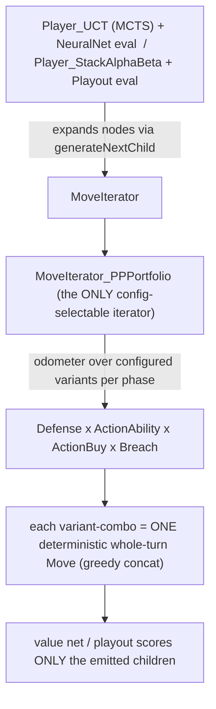

# RL Self-Play Loop — External Review Context

> Companion to the plan: `docs/superpowers/specs/2026-06-02-rl-selfplay-loop-design.md`.
> You (reviewer) have zero prior knowledge of this project. This document is your only window into the codebase; the plan author has full code access and will validate your suggestions.

## 1. Reviewer Brief

You are receiving **two documents**: this context doc and the **plan** (the RL self-play loop design spec). Your job is to **critically analyze the plan** — find weaknesses, risks, missing considerations, better alternatives, unnecessary complexity, things to remove, and things that are good and must be preserved. Be constructively critical, not a rubber stamp. You do **not** have codebase access — flag uncertainty and state assumptions; the author validates them.

**Structure your review as:**
1. **One-line verdict** — overall assessment in a sentence.
2. **What's good** — keep as-is, and why.
3. **Concerns & risks** — ranked by severity.
4. **Suggested changes** — specific, actionable, referencing plan section numbers.
5. **Alternatives** — different approaches worth considering.
6. **Additions** — what's missing that should be there.
7. **Removals** — what shouldn't be there.
8. **Minor / nits** — low-priority.
9. **Assumptions you're making** — where you lacked code visibility and had to guess.

Domain expertise most useful here: **self-play / AlphaZero-style RL, MCTS, value-net training, non-stationary fine-tuning, catastrophic forgetting, experiment design.** You do **not** need to know Prismata deeply — section 11 has a glossary.

## 2. Project Overview

**Prismata** is a turn-based, **perfect-information, deterministic** 2-player strategy game (by Lunarch Studios) — economy + combat, ~116 units, no hidden information, no dice. It's an ideal AlphaZero-class RL target (the same class where MCTS + value net has solved far larger games).

This project is a C++ engine + AI for Prismata, with a **DeepSets value network** ("DSNN") trained to evaluate positions. The engine and base AI are mature (years of work); the **RL self-play loop is a new workstream**.

**The decision the plan serves (go/no-go):** *Does RL self-play meaningfully improve the value net beyond the supervised baseline, without regressing?* The deliverable is a **defensible go/no-go signal, not a finished agent.**

**Constraints:**
- **Solo developer**, cost-conscious, prefers local compute.
- **~£400 (~$500)/month** budget cap for paid (AWS) compute. The philosophy is: spend free local engineering first (build the loop + get a first signal locally on consumer hardware), only pay AWS to *scale* the answer.
- Hardware: AMD Ryzen 7 5700X3D (8c/16t), 32GB RAM, **Intel Arc B580 (12GB)** GPU. Training uses the Arc via Intel's XPU/oneAPI path on **native Windows**.

## 3. Architecture & Tech Stack

- **Engine + AI:** C++ (x64). Two relevant builds (see §4). Config-driven: AI players are defined in a JSON `config.txt`.
- **Value net:** PyTorch DeepSets model; per-instance tokens with **35 production-vector properties** (auto/click resource production, costs, sac, chill, etc.). Exported to a binary `.bin` the C++ engine loads for CPU-side inference. Supervised baseline ~82% val accuracy (a health check, not the goal).
- **Eval harness:** a JavaScript engine port (`matchup_clean.js`) that drives the C++ exe per-turn (used for Steam-binary matchups), **plus** a native C++ tournament runner (config "Benchmarks").

**The AI's move generation (load-bearing for the whole plan):**

**Critical invariant (the move-gen 'law'):** the search can only choose among moves the iterator *emits*, and the value net only scores *those* children. So **RL can only learn what move-generation proposes.** There is a richer enumerator family (`MoveIterator_All*`) that includes "don't click" candidates, but it is **not config-selectable** (the config parser only accepts `PPPortfolio`) and is offline-only. **There is no policy head; PUCT is off.** Exploration in MCTS is UCB1 with constant `cValue`.

**The deployed move generator** for the DSNN players is a `PPPortfolio` whose dimensions were `1×1×5×1` (Defense × ActionAbility × ActionBuy × Breach) — i.e. only the 5 ActionBuy plans varied; Defense/Ability/Breach were pinned to one deterministic line each. The plan's starting config widens the **ability** phase to 5 variants (`1×5×5×1`).

## 4. Codebase Map

Two sibling local checkouts (this matters a lot — see §6):

- **`c:/libraries/PrismataAI/`** (branch `feature/production-vectors`) — the main repo: contains **`engine_v2`** (a clean-room engine rewrite, **now avoided** — see §6), the **training pipeline** (`training/train.py`, `export_weights_v2.py`, schema), the **JS engine + eval** (`js_engine/matchup_clean.js`), the **docs/specs** (incl. the plan), and a replay-parser sibling repo.
- **`c:/libraries/PrismataAI-dave-master/`** (branch `dave-master-jsonclean`) — **`engine_v1`** = the original author's clean engine line; **this is the RL target.** Self-play, training-data export, eval, and the DSNN port all run here.

Key files relevant to the plan (engine_v1):
- `source/ai/MoveIterator_PPPortfolio.cpp` — deployed move generator (the portfolio odometer).
- `source/ai/PartialPlayer_*` — ~35 phase "partial players" (Defense/ActionAbility/ActionBuy/Breach); each emits one deterministic move.
- `source/ai/UCTSearch.cpp`, `Player_UCT`, `StackAlphaBetaSearch.cpp` — search; consume the iterator's `generateNextChild`.
- `source/ai/NeuralNet.cpp`, `Eval.cpp` — CPU value-net inference (UCT-only; AlphaBeta uses Playout).
- `source/engine/Random.cpp` — RNG (a reproducibility issue, §6).
- `bin/asset/config/config.txt` — all AI players + move-iterator portfolios (JSON).
- Training (main repo): `training/train.py` (PyTorch, supports `--device xpu`), `training/export_weights_v2.py`, `training/data/*.h5`.
- Replay parser (sibling repo): `audit_ranked_balance.py`, `ladder_validate.py` — built the exact-match-clean human training set.

Scale: a large mature C++ codebase (engine + AI) plus a Python training pipeline and a JS engine port. Exact LOC not measured here.

## 5. Relevant Existing Patterns & Conventions

- **AI is config-driven:** players/iterators/partials are composed in `config.txt` (JSON). Many experiments are config-only (no rebuild). New C++ partials require a rebuild.
- **Per-player NeuralNet:** each UCT player can load its own weights file; two NN players with the **same** weights run fine in one process (verified — a prior sweep ran 8 NN players in one tournament).
- **Build:** VS solution, **x64 only**, toolset v145. The **GUI project is currently broken** (SFML 3.x API drift); the plan's loop only needs the `Prismata_Testing` / `Prismata_Standalone` targets (build those, skip GUI).
- **Eval/test:** C++ tournament "Benchmarks" (auto-runs `run:true` blocks) and `--suggest` / the JS `matchup_clean.js` harness.
- **Self-play data:** `SelfPlayDataExport` writes binary shards → converted to JSONL → vectorized to HDF5 → `train.py`.
- **Labels:** game outcome, per active-player, draws = 0.5. A historical **P0/P1 label-inversion bug** has bitten before — labeling correctness is a known hazard.

## 6. Current State & Known Issues

**Works today:**
- engine_v1 builds and runs (x64 native Windows); DSNN runs end-to-end (UCT + CPU NeuralNet eval).
- The **5-variant ability portfolio is validated**: a new player `DSNN_Mixed35_5var` beat the 1-variant `DSNN_Mixed35` **76.5–51.5 over 128 games (59.8%)** at equal 7s think (both sides identical think regime — verified the result wasn't confounded by a think-time override). This is the RL starting config.
- Two "anti-waste" rules (`AvoidDefenseWaste`, `AvoidResourceWaste`) and a config null-deref guard were just ported into engine_v1 (commit `89c220e`); a smoke run confirmed end-to-end play.

**Known issues / hazards:**
- **`engine_v2` is indicted.** The main repo's clean-room engine (`engine_v2`) was found ~33 points weaker than the original author's `engine_v1` and is **avoided**. All RL work is on `engine_v1` (`dave-master-jsonclean`). Reviewers: treat "use engine_v1" as fixed.
- **RNG not reproducible as-is.** `Random::Seed()` exists but mixes `std::hash<thread::id>` into the seed → not reproducible across runs, and only reseeds the calling thread. The plan's temperature sampler needs a clean, seedable stream (listed as a prerequisite).
- **No policy head; PUCT off.** The DeepSets model is value-only. MCTS exploration is UCB1 (`cValue`, currently 0.3, tuned for the net's small value-differences). A policy head is explicitly deferred.
- **P2 win-rate asymmetry (~57%)** is real (going second has compensation). Must not be mis-attributed to a bug.
- **A `FORCE_DSNN` / think-time override** exists in the Steam-protocol path (`GetAIMove`), gated on a sentinel/env var, that bumps 7000ms→10000ms. It is **isolated from the tournament/eval path** (verified) — but it's a known footgun for eval contamination.
- **GUI build broken** (SFML 3.x) — irrelevant to the loop, but means "build the full solution" fails; build the non-GUI targets.

**Recent significant change:** the 5-variant port + the two anti-waste rules (commit `89c220e`, local, engine_v1).

## 7. Context Specific to the Plan

- **What the loop touches:** the engine_v1 self-play binary (`SelfPlayDataExport`), `train.py` (XPU fine-tune + replay buffer + rehearsal sampler), `export_weights_v2.py`, and the eval harness (C++ tournament + `matchup_clean.js`). New code: a **temperature move-sampler** (self-play-only, sampling root candidates ∝ `visits^(1/τ)`; deployment keeps argmax), an **RNG fix**, and config for an Infusion-Grid-optional ability variant.

- **Value-net training-data provenance (verified):** the supervised net's MasterBot half came from **real Steam MasterBot self-play** (the 2016 binary, run on the live 5-variant config), *not* weak C++ self-play as earlier docs implied; the human half is **exact-match-clean 1800+** (every unit's stats verified equal to the current card library across 30 fields, removing ~9.4% stat-drifted contamination). Consequence: the 5-variant action space is **in-distribution** for the net, so today's 1-variant deployment is a *train/deploy mismatch* the 5-variant config corrects (part of why the A/B gained ~10 points).

- **Prior attempts / rejected approaches:**
  - The old `LiveHardestAI` (a heuristic config matching the live game) lived in **engine_v2** and was a weak (~22% vs the real MasterBot) approximation; it also **segfaulted** when ported to engine_v1 (an undefined config reference → null-deref — now fixed by the guard). The plan's external yardstick is therefore the **real 2016 MasterBot binary (`STEAMAI` / `PrismataAI.exe.ORIG`)**, not `LiveHardestAI`.
  - WSL2/Linux for the *local* loop was reconsidered and dropped: engine_v1 builds x64 natively on Windows and XPU training already runs on Windows, so Arc-GPU-in-WSL (flaky) is avoided; WSL is AWS-prep only.

- **Action-space widening (make-or-break):** RL can only learn proposed moves. The first widening axis is **Infusion Grid optional** — currently the AI is *forced* to fire Infusion Grid's self-sac whenever legal (a provably-often-wrong, discrete decision even the real MasterBot gets wrong); making it a portfolio choice is the cleanest "open a forced click → does RL learn when to use it?" signal. A reachability audit already found some units (Wild Drone, Doomed Drone) the off-book buy path **cannot construct at all** — so dropping the opening book to "explore openings" would *close* those lines unless the buy filter is widened too.

- **Compute/scale:** self-play is CPU-bound (NN inference is CPU C++); training is the GPU step (XPU on the Arc). AWS scale (~£400) buys ~hundreds of instance-hours for volume self-play + several RL iterations.

## 8. Scope Boundaries

**Out of scope:** a finished/strong agent (this is a go/no-go); a policy head + PUCT (deferred efficiency multiplier); WSL/Linux for the *local* loop (AWS-prep only); broad supervised HP re-tuning (low ROI).

**Fixed / non-negotiable (don't propose alternatives):**
- Engine = **engine_v1** (`dave-master-jsonclean`).
- **Value-only RL** (no policy head) for this phase.
- Local proof-of-life **on native Windows** first; AWS only to scale.
- Self-play search budget = **fixed sims** (not wall-clock).
- Loop = **gated single-iteration** for proof-of-life (graduate to closed-loop at AWS).
- ~**£400/month** paid-compute ceiling.

**Deliberately accepted trade-offs:** value-only MCTS (no policy guidance) may be sample-inefficient on a wide action space — accepted for now, policy head deferred; the proof-of-life runs on consumer hardware (slow wall-clock) to avoid paying to debug a loop.

## 9. Success Criteria

- **Local go-criterion (justifies AWS spend):** any *measurable* win-rate improvement on the target axis (e.g. Infusion-Grid usage) **without** general regression, on the win-rate eval.
- **Primary metric:** head-to-head **win-rate trajectory** across RL iterations, measured vs **three anchors** — (1) *wide-untrained iter-0* (current weights on the newly-widened config, before RL — isolates RL's contribution from the widening's own cost), (2) the *narrow baseline* `DSNN_Mixed35_5var`, (3) the *real MasterBot* (`STEAMAI`/.ORIG). Evaluated on forced-set **and** general card pools (forgetting check).
- **Supervised val** is a *secondary* diagnostic only (with SWA, it doesn't drive checkpoint selection).
- **AWS go/no-go:** an improving win-rate trajectory across iterations → continue monthly; flat → stop / rethink the action space.

## 10. Key Questions for Reviewers

1. **Value-only RL without a policy head:** is plain MCTS (UCB1, `cValue`, no PUCT/prior) sample-efficient enough to improve a warm-started value net via self-play on this action space, or is the missing policy head a likely cause of a *false-negative* go/no-go? Is deferring it the right call?
2. **Self-play search budget (fixed sims) and the many-games-vs-deep-search trade-off:** given value-only learning with the *game outcome* as the label, what sims/move floor avoids degenerate play while maximizing games? Any principled way to set it beyond trial-and-error?
3. **Is the action space wide enough to show signal?** The proof-of-life runs RL on the 5-variant portfolio (temperature explores ≤~25 whole-turn candidates). Is that enough room for RL to demonstrably improve, or should the first loop already include a widening (e.g. Infusion-Grid-optional) to have something to learn?
4. **Exploration mechanics without a policy/Dirichlet-noise prior:** the plan explores via (a) within-game temperature on MCTS *visit counts* and (b) fixed `cValue`. Is visit-count temperature sufficient diversity for self-play on a small discrete candidate set, or is something AlphaZero-style (root noise analogue) needed despite the absence of a policy prior?
5. **Replay buffer + rehearsal balance:** sliding window W + a rehearsal mix of (exact-match-clean human + MasterBot-self-play-for-coverage). Risk of catastrophic forgetting vs. anchoring to weaker (MasterBot-level) value targets — is the proposed balance sound, and how would you set W / rehearsal fraction?

## 11. Glossary / Domain Terms

- **Prismata:** perfect-information, deterministic 2-player economy/combat strategy game (~116 units).
- **DSNN / value net:** the DeepSets neural network that scores a position → win probability. **No policy head.**
- **35 production-vector features:** per-unit input properties (resource production split, costs, self-sac, chill, etc.) letting the net value units MasterBot rarely buys.
- **PartialPlayer:** a deterministic move-generator for one game phase (Defense / ActionAbility / ActionBuy / Breach). Emits exactly one move.
- **MoveIterator_PPPortfolio:** the deployed move generator — a Cartesian "odometer" over configured partial-player variants per phase. The *only* config-selectable iterator.
- **MoveIterator_All\*:** offline brute-force enumerators (include "don't click"); **not** config-selectable, not real-time.
- **Player_UCT / Player_StackAlphaBeta:** the two search players; UCT uses the value net, AlphaBeta uses random Playout rollouts.
- **cValue:** the UCB1 exploration constant (currently 0.3, tuned for the value net).
- **Opening Book (OB):** a scripted lookup that forces the turn-1/2 buy on exact-state matches.
- **Anti-waste rules** (`AvoidAttackWaste` / `AvoidResourceWaste` / `AvoidDefenseWaste`): "KEEP" prunes that remove provably-dominated moves (e.g. don't let decaying red resource expire) — gifts to RL because they shrink the search to non-dominated moves.
- **engine_v1 (`dave-master-jsonclean`) vs engine_v2:** the original strong engine (RL target) vs an indicted clean-room rewrite (~33 pts weaker, avoided).
- **MasterBot / `STEAMAI` / `.ORIG`:** the real 2016 Steam Prismata AI binary — the external strength yardstick. `.ORIG` is the user-preserved original (the live `PrismataAI.exe` was swapped for the DSNN).
- **`DSNN_Mixed35_5var`:** the validated 5-variant-ability DSNN player (the RL starting config / narrow baseline).
- **Temperature (τ) / annealing:** softmax over MCTS visit counts; τ high = explore (flat distribution), τ→0 = exploit (argmax); annealing = lowering τ within a game (diverse openings → accurate late-game outcomes).
- **SWA:** Stochastic Weight Averaging — averages a window of training weights instead of picking one epoch (reduces reliance on the val set for checkpoint selection).
- **Forced-set curriculum:** forcing a target unit into each self-play game's random card set so it appears far more often than the ~7.6% it would by chance.
