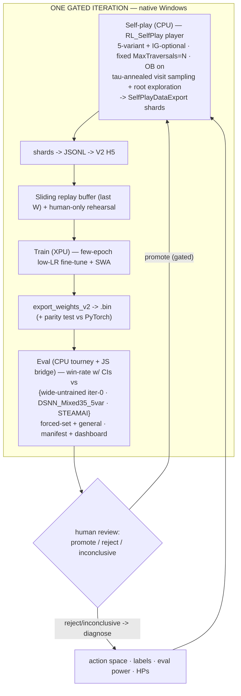

# RL Self-Play Loop — Design Spec (v2)

> Date: 2026-06-02 · v2 (post external review; see `META-REVIEW-2026-06-02-rl-selfplay-loop-design.md`).
> Must-do + Should-do changes applied inline, marked `<!-- CHANGED -->`. Consider-tier items are a pick-list in §13.
> Engine: `dave-master-jsonclean` (engine_v1). Companions: `docs/rl-action-space-partials-map.md`, `docs/plans/2026-05-31-linux-rl-bringup-and-go-no-go.md`.

## 1. Goal & scope

Operational playbook for the RL value-net self-play loop: a *gated single-iteration* loop, native Windows for the local proof-of-life, AWS scale as an outline. Decision served: **does RL self-play improve the value net beyond the supervised baseline, without regressing?** Deliverable = a defensible **go/no-go**, not a finished agent.

<!-- CHANGED: framing — a flat *local* result is uninformative, not a true negative (value-only MCTS at local scale is a measurement problem as much as a learning one) — Reviewers 1,3,4,5,6 -->
> **Interpretation guard (load-bearing):** a *flat* local result must be read as **"the local setup can't measure it,"** not **"RL doesn't work."** The local phase is a *lower bound* on RL's potential; the go/no-go decision rule (§12) encodes this asymmetry (a false-negative kills the project; a false-positive only wastes £400).

### Banked going in *(stays — reviewer-confirmed)*
- **5-variant ability portfolio validated:** `DSNN_Mixed35_5var` beat 1-variant `DSNN_Mixed35` **76.5–51.5 / 128 games (59.8%)** at equal 7s (verified un-confounded by the think-time override).
- **cValue = 0.3**; **data exact-match-clean** (`human_1800_v2`, 30-field unit audit); **two KEEP waste-rules + null-deref guard ported** (commit `89c220e`).

## 2. Loop architecture (gated single-iteration) *(stays)*



<!-- CHANGED: the FIRST RL campaign targets the IG-optional widening, not bare 5-variant — Reviewers 2,3,5,6 -->
**The first RL campaign runs on the IG-optional widened config (see §6.1), not the unchanged 5-variant** — the supervised net already encodes the 5-variant space, so a bare run risks an ambiguous flat result with nothing to learn. Environment (native Windows; self-play CPU, XPU train, CPU/JS eval) *unchanged*.

## 3. Self-play player (`RL_SelfPlay`)

Clone of `DSNN_Mixed35_5var` (NeuralNet eval, 5-variant portfolio + IG-optional, OB on, cValue 0.3) with:

- **Fixed-sims budget.** `MaxTraversals = N`, `TimeLimit` off (reproducible/plannable). <!-- CHANGED: N set by calibration, not feel — Reviewers 1,2,3,5,6 --> **`N` is set by a calibration sweep run *before* iteration 0** (§9 / M5), not guessed: sweep `N ∈ {100,256,512,1k,2k,5k}` with the frozen net, pick the **smallest N that passes the non-degeneracy check** (game-length within 2σ of the human-1800 baseline; P0/P1 win-rate ∈ [0.35, 0.65]; root visit-entropy above a floor; win-rate vs the 100k-sim deployment net not catastrophically low).
- **Within-game temperature.** Sample the chosen whole-turn move ∝ `visits^(1/τ)` over root candidates. <!-- CHANGED: numeric schedule + float math — Reviewers 1,2,5,6 --> Schedule = **step**: `τ=1` for the first **K≈6–8 plies**, then `τ→0` (greedy) so late-game outcome labels stay accurate. Compute `visits^(1/τ)` in floating point before normalizing. Eval/deploy keep **argmax**.
- <!-- CHANGED: root exploration injection — temperature alone is insufficient without a policy prior (THE #1 review consensus) — Reviewers 1,2,3,4,5,6 -->
  **Root exploration injection (required).** Visit-count temperature is *result* diversity, not *search* diversity: with UCB1 + small cValue the search concentrates visits, so the τ-sampler only reshuffles a narrow band. During the `τ=1` phase, self-play **(a) forces ≥1 visit to every root candidate before UCB1 exploitation, and (b) mixes in an ε-uniform component** over root candidates (start ε≈0.25): with prob 1−ε sample ∝ visits, with prob ε sample uniformly over the *non-waste-pruned* root candidates. This is the policy-free analogue of AlphaZero root noise. (Root Q-perturbation / Dirichlet-on-Q is an alternative — start with ε-uniform; it's simplest and seedable.)
- **Clean seedable RNG** (the `Random.cpp` thread-hash fix — §10.1); the sampler *and* MCTS tie-breaking must draw from a controllable stream for reproducibility.
- <!-- CHANGED: MaxChildren/traversal scaling under forced root exploration; incorporates O5 — user question -->
  **MaxChildren & traversal floor (code-checked).** `MaxChildren` is a **single per-node cap** (no separate root cap — `UCTNode.cpp:54`), and the deployed search expands the root **incrementally** (one child per traversal; PUCT's `generateAllChildren` is off). The root yields ≤25 candidates (5-variant) / ≤30 (IG-optional) — both **< 40, so `MaxChildren=40` already covers every root candidate for axis-1; no change needed.** Incremental expansion already gives each candidate ≥1 eval once `N ≥ ~30`, so the **ε-uniform mix (no extra traversals) is the real diversity lever**, not "forcing" visits. **Calibration constraint (add to M5):** `N` must be comfortably **> the root branching factor** so the mandatory initial expansion isn't most of the budget and depth survives. **Later/wider axes (O5):** when the root grows past ~40 candidates, raise **`MaxChildren` ≥ root branching factor AND scale `N` proportionally** — `MaxChildren` caps internal nodes too, so raising it widens the whole tree and *will* collapse search depth unless `N` rises with it.

## 4. Data & training regime

- <!-- CHANGED: label scale corrected to match the actual pipeline (BCE on [0,1]); the v1 "+1/-1/0.5" was inconsistent — Reviewers 2,3 + code-check -->
  **Labels: probability scale [0,1]** — **win = 1.0, draw = 0.5, loss = 0.0**, from the active-player's perspective (this is what `train.py` uses — BCE requires labels in [0,1]; the net maps value→`(v+1)/2`∈[0,1] for UCT). **Add label unit tests:** terminal win/loss/draw label correctly; opposite-active-player view inverts; aggregate P0/P1/P2 rates match the known ~57% P2 asymmetry; the historical P0/P1 inversion bug would fail the test. **Colour-balance training batches** (equal P1/P2 starts) so the value net isn't biased by start-advantage imbalance. <!-- CHANGED: P2 asymmetry is set-dependent and narrows at strong play — user --> (Note: the ~57% P2 figure is **highly set-dependent** and collapses toward **~51:49 at master-level human play** — so colour-balance for cleanliness, but do *not* hard-normalize to a fixed 0.57; the net should learn the small, set-dependent residual itself. This reinforces rejecting fixed-base-rate value labels (R-rej1) and asymmetric temperature (§13-O12).)
- **Sliding replay buffer:** last **W** iterations (start W≈5–10); sample each batch from the window.
- <!-- CHANGED: human-only value anchor at a named fraction; MB-fleet dropped from training value targets — Reviewers 1,2,3,4,5,6 -->
  **Rehearsal = human-only.** Anchor on `human_1800_v2` (exact-match-clean) at a **named fraction**: ~**30% human / ~70% self-play at iter-1, decaying to ~10–15% by iter-3** as self-play accumulates. **Do NOT put MasterBot-fleet data in the training value targets** (its MasterBot-level outcomes would cap the ceiling / fight the RL signal) — use MB-fleet only for the val/forgetting diagnostic, or at ≤5% with reduced loss weight if coverage of a specific unit is missing. Monitor for forgetting via win-rate vs `STEAMAI` + the human-val forgetting check.
- <!-- CHANGED: position-sampling controls + turn-cap note — Reviewers 2,5 + code-check (engine has a flat 200-turn limit, no stagnation detection) -->
  **Position sampling:** cap positions per game (or sample a fixed number per phase) and stratify early/mid/late so a few long games don't dominate; log position counts by ply. Self-play games are bounded by the engine's **200-turn limit** (no stagnation detection — long degenerate games are possible; the non-degeneracy check §3 catches systemic cases).
- <!-- CHANGED: SWA params + LR-schedule interaction — Reviewers 1,3,6 -->
  **Training:** **few epochs** (≈3–10), **low LR** warm-start fine-tune; **SWA** collected over the *flat/cyclic* portion of the LR schedule (start SWA after ~epoch 3; average every epoch thereafter). Note SWA's smoothing benefit needs a **non-flat collection LR** (cyclic/decay), not a purely flat one. Abort training on loss divergence.

## 5. Eval & promotion

- **Win-rate is the primary signal** (trajectory across iterations = go/no-go meter); supervised val is a *secondary* forgetting diagnostic only (SWA removes its checkpoint-selection role; it still flags divergence).
- **Three anchors per iteration** *(stays — the wide-untrained iter-0 control is the design's sharpest element)*:
  1. **wide-untrained iter-0** — current weights on the newly-widened config, before RL (isolates RL's contribution from the widening's OOD cost).
  2. **narrow baseline** `DSNN_Mixed35_5var` — absolute progress + regression check.
  3. **`STEAMAI`** (real 2016 MasterBot, `PrismataAI.exe.ORIG`) — external yardstick.
- <!-- CHANGED: quantitative methodology — CIs, paired sets, colour balance, sequential testing, inconclusive outcome — Reviewers 1,2,4,6 -->
  **Eval methodology (quantitative):** paired card sets played both colours; report Wilson (or Clopper-Pearson) 95% CIs; **win-rate = (W + 0.5·D)/N** (draw = 0.5); **sequential testing** — run 128 paired games, stop if decisive, else extend to 256 → 512, else mark **inconclusive**. Evaluate on **forced-set** (did the target unit improve?) and **general/random** (regression check). Pre-register N-per-anchor for the target effect size (e.g., to resolve a +5pp effect at p<0.05 needs ~600 games; +3pp needs ~1500 — so the local target effect should be stated and N sized to it).
- <!-- CHANGED: gate resolution — inconclusive outcome, primary comparison, rollback, reworded AWS line — Reviewers 1,2,4,5,6 -->
  **Promotion (gated):** outcomes = **promote / reject / inconclusive**. *Primary* comparison = candidate vs **current promoted net** (same config); do **not** require beating *every* anchor each iteration. Promote if it beats the current net with a CI lower-bound > 50% **and** general-pool delta ≥ −Y (small tolerance). **Rollback rule:** if iter K regresses vs K-1 on the general pool beyond Y, revert net + buffer and reduce LR or W. "Stall" = inconclusive at the max sequential N. **If gating stalls, first increase eval N / diagnose power — do *not* drop the gate.** Accept-all is an *AWS-scale* option only after the loop is validated and eval is the bottleneck, **with automated rollback retained**.
- <!-- CHANGED: per-iteration export-parity test — Reviewers 2,3 (harness exists from the DSNN-port audit) -->
  **Export parity:** every iteration, compare PyTorch vs C++ `.bin` value on ~1000 sampled positions; assert max abs error below threshold (the parity harness exists from the DSNN-port audit, |Δ| was ≤1.3e-6). Catches silent export/schema/feature-order breakage.
- <!-- CHANGED: single eval path per anchor + cross-path sanity — Reviewers 1,2 -->
  **Eval paths:** C++ tournament for config-player anchors (1,2; per-player NeuralNet runs two NN players in one process when weights match); `matchup_clean.js` (SteamAI bridge → `.ORIG`) for anchor 3. **One path per anchor**, documented; run a one-off cross-path sanity check (`HardestAIUCT` vs itself on both paths) to bound the path effect. **Eval contamination checks each run:** `use_dsnn.txt`/`PRISMATA_FORCE_DSNN` absent, expected net-hash loaded, fixed-sims active, `.ORIG` used for `STEAMAI`.
- <!-- CHANGED: per-iteration manifest + dashboard + action-coverage instrumentation — Reviewers 1,2,3,6 -->
  **Manifest + dashboard (per iteration):** manifest = {resolved-config-hash (post-parser), parent/trained/exported net-hashes, seed range, games, positions, replay window, rehearsal datasets+weights, eval card pools + results, promotion decision}. Dashboard = win-rate vs each anchor (with CIs, forced+general); self-play game-length vs prev; **action-coverage metrics** (avg root candidates, root entropy, % positions where IG is legal, **IG fire-vs-skip frequency in self-play and at argmax**, win-rate conditioned on IG availability); training loss by source; export-parity error; val Brier/accuracy.

## 6. Action-space widening curriculum

RL only learns what the generator proposes. Widen **one axis at a time**, each with its own pre-training wide-untrained control (§5 anchor 1). *(curriculum framing stays.)*

1. <!-- CHANGED: IG-optional is the FIRST RL campaign (not a later experiment) + forced-set in the spec body — Reviewers 1,2,3,5,6 -->
   **Infusion Grid optional — the first RL campaign.** Config-only: add an ability portfolio variant where Infusion Grid (`Hotel`) is in the `ActivateUtility` filter (suppressed), alongside the variants where it fires → the portfolio offers both "fire IG" and "skip IG" whole-turn candidates → search/value-net picks → RL learns *when*. **Forced-set curriculum (now in the spec body):** force Infusion Grid into the random card set of **every self-play AND every eval game** for this axis, so the per-unit signal is measurable (vs ~7.6% by chance). The go-signal is the IG fire/skip behaviour change + win-rate vs the wide-untrained iter-0 anchor, not aggregate win-rate alone.
2. **OB-off + buy-filter-widen (together).** Gated on the full **116-unit off-book reachability audit** (a finite scriptable check — Wild Drone / Doomed Drone already shown unbuildable off-book; the audit defines the `RL_Explore` filter). <!-- CHANGED: dynamic sims under widening — Reviewers 4,5 --> When this (or any) widening grows the branching factor, scale `N` to hold search depth roughly constant (see §13-C5).
3. **Red buy-vs-click split** (Perforator/Animus; `ARW` firing-rate → 0 is the diagnostic). C++ work.
4. **Defense/breach branching** (wire the already-implemented `Defense_Default`/`Breach_Default`).

## 7. Managing concurrent heuristic (MB-weakness) changes *(stays — reviewer-praised)*

Triage with the KEEP/OPEN lens: **KEEP-style heuristic *bugs*** (dominated misplays — stamina-blind absorb, Galvani-over-Drone breach, chill on irrelevant walls, resource floating) → fix programmatically (they only remove provably-worse moves, helping RL); **valuation/strategy** weaknesses (Gauss-rush, passivity, Zemora/Antima planning) → **leave for RL**. **One change per measured point:** pin a versioned baseline = (**resolved-config-hash**, net-hash) <!-- CHANGED: hash the resolved (post-parser) config, not source JSON — Reviewer 1 -->; A/B a heuristic fix with the *fixed* net, then merge + re-anchor (re-run iter-0 wide-untrained). RL iterations change **only the net** on a frozen config. **Never change heuristics mid-RL-campaign** <!-- CHANGED: freeze all non-essential heuristics during the first campaign — Reviewers 2,3 --> — during the first proof-of-life campaign, freeze the engine/config except the RNG fix, the temperature/root-exploration sampler, the IG-optional variant, and correctness bugs that invalidate the run. Maintain a changelog mapping every win-rate point to one (config, net) delta.

## 8. Go/No-Go & cost

- <!-- CHANGED: quantitative go-criterion + kill criteria — Reviewers 1,2,3,4 -->
  **Local go-criterion (quantitative):** RL-trained net beats the **wide-untrained iter-0** anchor by **≥ the pre-registered effect size at the pre-registered N, CI lower-bound > 0**, with **general-pool delta ≥ −Y** (no material regression) — measured on the IG-optional axis (IG fire/skip behaviour demonstrably learned). → justifies AWS spend.
- **Kill criteria (local):** if ≥**3 consecutive iterations** show no improvement beyond the CI **and** the false-negative triage (§9) passes (action present, temperature sampling, labels valid, predictions changed, export parity OK, eval powered, self-play non-degenerate), terminate the local phase and either increase N, widen further, or reconsider value-only (→ §13-C6 policy-head fallback).
- <!-- CHANGED: measure throughput before AWS — Reviewer 2 -->
  **Before AWS:** measure games/hour at the chosen N, NN-evals/sec, CPU utilization, shard write throughput, eval games/hour — self-play is CPU-bound, so size the £400 against measured throughput, not assumption.
- **AWS (£400):** scale self-play volume + iterations; an improving win-rate **trajectory** (define: ≥2 consecutive iters of CI-clearing improvement) → continue monthly; flat → stop / rethink action space.

## 8.5 Iteration-0 de-risking & label-quality diagnostics *(incorporates O1, O2, O4)*

<!-- CHANGED: incorporate optionals O1 (high-sim early data), O2 (deep-label reference batch), O4 (offline-RL iteration-0) — user selected -->
Cheap guards against the #1 risk (shallow-search label noise → false negative), run before/at iteration 0:
- **O4 — Offline batch-RL iteration-0 (no loop):** generate one fixed self-play dataset (on the IG-optional config), train the net on it once, eval. If the net improves with *no feedback loop*, that's a clean positive signal with zero self-play-poisoning risk — and it validates the data→train→export→eval pipeline before the online loop is built.
- **O1 — High-sim early data:** generate iteration-0/early batches at *deep* search (~10k–50k sims, ≈100 games overnight on the box) instead of the volume-`N` budget. Cleaner labels invert the many-games-vs-depth trade-off for the proof-of-life, where the question is *"can RL improve the net at all?"* not *"cheaply?"*.
- **O2 — Deep-label reference batch:** hold a small batch labelled by deep search; train on the shallow-`N` self-play labels but *also* report the net's loss on the deep-label batch. A much-lower deep-label loss ⇒ shallow search is the bottleneck (not net capacity or the RL algorithm) — a direct false-negative diagnostic feeding the §9 triage.

## 9. Risks & false-negative guards

- <!-- CHANGED: value-only MCTS sample-inefficiency elevated to the top risk; flat local = uninformative — all reviewers -->
  **[TOP] Value-only MCTS without a policy prior may be sample-inefficient on a widened action space** → false negative. Guards: root exploration (§3-M1), N-calibration (§3-M5), the interpretation guard (§1), and the §13 diagnostics (high-sim/deep-label). A flat *local* result is uninformative, not a true negative.
- <!-- CHANGED: promote "pipeline built for playout self-play" to a risk — Reviewers 1,3 -->
  **`SelfPlayDataExport` was exercised with playout self-play, not DSNN(UCT+NN) self-play** — verify the shard→JSONL→H5 round-trip with DSNN self-play before iter-1 (a possible blocking C++ task).
- **Action space too narrow** → guard: the widening curriculum + action-coverage metrics (catch "the new action was never generated" vs "RL failed").
- **Argmax self-play (no exploration)** → guard: temperature + root exploration (§3).
- **Wrong baseline** → guard: wide-untrained iter-0 anchor.
- **Label bugs** (P0/P1, P2, scale) → guard: label unit tests + colour balance (§4).
- **RNG non-reproducibility** (`Random::Seed` thread-hash; MCTS tie-break RNG) → guard: §10.1 fix + single-thread deterministic mode + fixed sims.
- **`FORCE_DSNN`/think-time override leaking into eval** — verified isolated; guard: eval contamination checks (§5).
- <!-- CHANGED: explicit false-negative triage checklist — Reviewers 2,3 -->
  **False-negative triage (run before declaring no-go):** (1) was the new action in the root candidate set often enough? (2) did temperature actually sample non-argmax? (3) labels pass inversion/scale tests? (4) did training change predictions on self-play positions? (5) does exported `.bin` match PyTorch? (6) did eval load the intended net? (7) was eval statistically powered? (8) was self-play non-degenerate at N? (9) did rehearsal overwhelm the RL signal? (10) target-up but general-down (overfit, not no-learning)?

## 10. Prerequisites & open implementation items

1. **RNG fix** (`Random.cpp`): seedable, thread-hash-free stream for the temperature sampler + MCTS tie-breaking; single-thread deterministic mode.
2. **Temperature + root-exploration sampler** (self-play-only; ε-uniform + forced ≥1-visit; argmax preserved for eval). **Unit-test the sampler** against a known visit distribution before it touches the engine.
3. **`RL_SelfPlay` config**: 5-variant + IG-optional + fixed `MaxTraversals` + temperature/ε flags + `SelfPlayDataExport`.
4. **Self-play data pipeline**: confirm `SelfPlayDataExport`→JSONL→V2 H5 round-trips with DSNN self-play; record **both** the temperature-sampled move and the search's argmax in the shard (for offline analysis).
5. **Replay buffer + human-only rehearsal sampler** in `train.py` (window W + named fraction + decay + position-sampling controls).
6. **Eval harness**: tournament blocks for the 3 anchors on forced-set + general, with CIs + sequential testing + manifest; build the **6s/12s human val** (exact-match-audited); **export-parity check**.
7. **116-unit off-book reachability audit** → `RL_Explore` filter (gates widening axis 2; can be parallelized — does not block axis 1).
8. **Infusion-Grid-optional ability variant** (config) + forced-set card-pool wiring for axis 1.
9. **N-calibration sweep** (§3) + the non-degeneracy check, run before iter-0.
10. <!-- CHANGED: freeze the HP tuple before iter-1 — Reviewer 1 -->
    **Freeze the HP tuple before iter-1:** (N, τ, K, ε, W, rehearsal fraction+decay, gate margin, rollback margin, eval N, target effect size). Treat any change as a *new campaign*.

## 11. Tunables (set up front; monitor; don't re-sweep each iteration)

`N` (calibrated), `τ`/`K`/`ε` schedule, `W`, rehearsal fraction + decay, gate margin, rollback margin, **SWA start-epoch + window**, **eval N + target effect size**. RL HPs are *scheduled*, frozen per campaign — not HPO-tapped on the eval signal.

## 12. Local go/no-go decision rule *(new)*

<!-- CHANGED: explicit quantitative decision rule — Reviewers 1,2,4 -->
```
pre-register: effect_size E (pp), eval N per anchor (sized to E at p<0.05), regression tol Y.
run IG-optional campaign for up to MAX_ITERS, gated promotion (§5).
for each iteration:
    d_rl   = winrate(net_k) - winrate(wide-untrained iter-0)   # RL's contribution
    d_reg  = winrate(net_k, general) - winrate(baseline, general)
    if  CI_lower(d_rl) > 0  AND  d_rl >= E  AND  d_reg >= -Y:
        GO (spend AWS) — RL demonstrably improved the net on the widened axis.
if MAX_ITERS reached with no GO:
    run false-negative triage (§9). 
    if triage clean and still flat:  conclude "local setup cannot measure it" (NOT "RL fails").
        -> raise N, widen further, or invoke the policy-head fallback (§13-C6) before spending.
    else: fix the flagged issue and re-run (new campaign).
```

## 13. Optional Enhancements (pick what you want)

**Decision status (this round):**
- ✅ **Incorporated:** **O1, O2, O4** → §8.5 (iteration-0 de-risking). **O5** → §3 (MaxChildren/`N` scaling under widening).
- ⏳ **Pending your call (explained in chat):** **O3** (distillation bootstrap), **O6** (candidate-level policy-head fallback), **O7** (tactical/blunder regression suite).
- 📦 **Documented for later, not now:** **O8** (opponent pool — AWS-scale anti-overfitting; revisit at scale).
- ❌ **Declined:** **O9** (overlaps root exploration), **O10** (two-stage training), **O11** (intrinsic motivation), **O12** (asymmetric temperature — the P2 edge is set-dependent and ≈51:49 at master-level human play, so not worth the knob).

The descriptions below remain as reference.

1. **High-sim data for early iterations** — generate fewer, *deeper* (10k–50k-sim) self-play games for cleaner labels at proof-of-life, inverting the many-games-vs-depth trade-off. *(R3)* — Effort: medium. **Lean yes** (strong false-negative guard; the box can generate ~100 deep games overnight).
2. **Deep-label reference batch** — train on shallow-search labels but also measure loss on a small deep-search-labelled batch; a much-lower deep-label loss ⇒ shallow search is the bottleneck (not capacity/algorithm). *(R3)* — Effort: small. **Lean yes** (direct, cheap diagnostic).
3. **Distillation bootstrap** — train the value net on high-sim **visit-count soft targets** (no-policy-head way to distil deep search into the value function). *(R1, R3)* — Effort: medium-large (new loss term). **Neutral.**
4. **Offline/batch-RL iteration-0** — train once on a *fixed* self-play dataset (no loop) and eval, to de-risk before building loop infra. *(R3)* — Effort: small. **Lean yes.**
5. **Dynamic sims budget** — scale `N` with the root branching factor as the action space widens, to hold search depth constant. *(R4, R5)* — Effort: small. **Lean yes for axis-2+** (constant N is fine for axis-1).
6. **Candidate-level policy-head fallback (document, don't build)** — if value-only flatlines, a policy *over the ≤25 portfolio candidates* enables PUCT cheaply (far less than full action encoding). *(R2)* — Effort: large (later). **Lean yes to document** as the §8 kill-criteria escalation.
7. **Tactical/blunder regression suite** — fixed hand-labelled known-weakness positions ("should/should-not fire IG", resource-float, breach-target) as a fast leading indicator before expensive eval. *(R2, R3)* — Effort: medium. **Lean yes.**
8. **Opponent pool** (AWS) — generate some games vs {current, prev, iter-0, narrow, STEAMAI} instead of pure latest-vs-latest, to reduce overfitting. *(R2)* — Effort: medium. **Neutral (AWS-scale).**
9. **Forced-diversity schedule** — force a random (non-waste) portfolio variant in ~5–10% of self-play decisions early, phase out; a structural complement to ε-uniform root noise. *(R3)* — Effort: small. **Neutral** (overlaps M1).
10. **Two-stage training** (RL fine-tune, then a brief supervised calibration pass) instead of mixed-batch rehearsal. *(R4)* — Effort: medium. **Lean no** (mixed-batch is the literature norm; two-stage risks oscillation).
11. **Intrinsic-motivation / novelty exploration bonus** in MCTS. *(R3)* — Effort: large. **Lean no** (premature).
12. **Asymmetric / game-phase-specific temperature** (e.g., P1 hotter to offset the P2 edge; sharper endgame annealing). *(R1, R3)* — Effort: small. **Lean no for v1** (follow-up).
