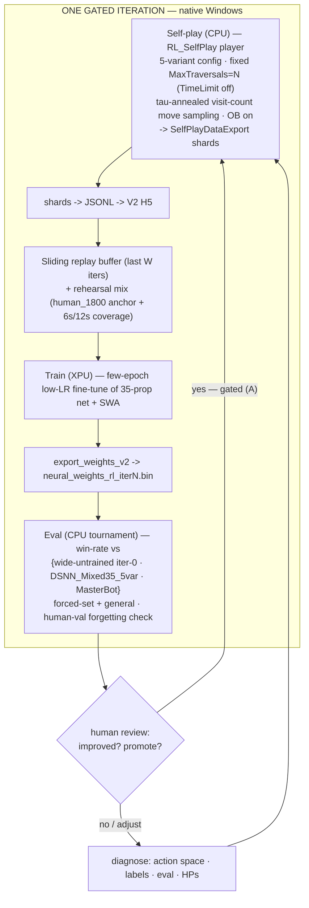

# RL Self-Play Loop — Design Spec

> Date: 2026-06-02
> Status: design (pre-implementation). Companion to `docs/plans/2026-05-31-linux-rl-bringup-and-go-no-go.md` (strategic 5-phase frame) and `docs/rl-action-space-partials-map.md` (action-space map).
> Engine: `dave-master-jsonclean` (engine_v1) at `c:/libraries/PrismataAI-dave-master/`.

## 1. Goal & scope

An **operational playbook** for the RL value-net self-play loop: the iteration engine that turns self-play games into an improved value net. It answers the bring-up doc's go/no-go: **does RL self-play improve the value net beyond the supervised baseline, without regressing?**

- **Loop shape:** *gated single-iteration* (human reviews after each iteration), run **entirely on native Windows** for the local proof-of-life; graduate to a closed unattended loop at AWS scale.
- **In scope:** the iteration mechanics (self-play → train → export → eval), the HP schedules, the eval/promotion methodology, the action-space-widening curriculum, and the discipline for concurrent heuristic changes.
- **Out of scope (prerequisites, referenced not designed here):** the Linux/WSL CMake build (AWS-prep only — *not* needed locally), and the broader Phase-0/1/2 strategy (covered by the bring-up doc).

### Banked going in
- **5-variant ability portfolio** is live and validated: `DSNN_Mixed35_5var` beat the 1-variant `DSNN_Mixed35` **76.5–51.5 over 128 games (59.8%, +~10pts)** at equal 7s think. This is the RL **starting config** and the **narrow baseline** anchor.
- **cValue = 0.3** (pre-RL sweep; 2.0 default was worst).
- **Training data is exact-match-clean:** `human_1800_v2` (← `final_training_codes_1800.txt`) was filtered by `audit_ranked_balance.diff_unit` across 30 unit fields (toughness/fragile/lifespan/attack/abilityScript/HPUsed/… ) — the ~9.4% buyCost+rarity-only contamination is removed.
- **Two KEEP rules ported** to dave-master: `AvoidDefenseWaste` + `AvoidResourceWaste` (both in the shared chains; `ARW` runs last, after `AvoidAttackWaste` refunds Perforator red).

## 2. Loop architecture (gated single-iteration)

**Environment (native Windows; no WSL until AWS):**
| Stage | Compute | Tool |
|---|---|---|
| Self-play | CPU (NN inference is CPU-side C++) | dave x64 `Prismata_Testing.exe`, `SelfPlayDataExport` |
| Train | XPU (Arc B580) | `train.py --device xpu` (fine-tune the 35-prop net) |
| Export | CPU | `export_weights_v2.py` → `.bin` |
| Eval | CPU | C++ tournament harness (Benchmarks) |

WSL/Linux CMake build is deferred to AWS-parity prep only; the local loop needs none of it (dave builds x64 natively on Windows; XPU training already runs on native Windows).

## 3. Self-play player (`RL_SelfPlay`)

A clone of `DSNN_Mixed35_5var` (NeuralNet eval, 5-variant ability portfolio, OB **on**, cValue **0.3**) with two changes:

- **Fixed-sims budget.** `MaxTraversals = N`, `TimeLimit` effectively disabled. Rationale: reproducible/comparable compute per move across machines (local↔AWS) and iterations; plannable games/hour. `N` is tunable — start moderate (order few-hundred to ~1–2k traversals; the deployed 100k is far more than data-generation needs) and tune by throughput + a non-degeneracy check (self-play must not play garbage).
- **Within-game temperature (new self-play-only code path).** After search, sample the chosen whole-turn move ∝ `visits^(1/τ)` over the root portfolio candidates (no policy head → visit-count temperature is the exploration knob). Schedule: **τ = 1 (proportional) for the first K plies → τ → 0 (greedy) thereafter**, so late-game outcomes (the value labels) stay accurate. K small (Prismata games are short). Eval/deployment keep **argmax** untouched. Requires a **clean, seedable RNG** (the `Random.cpp` thread-hash mix is not reproducible as-is — see §9).

Temperature explores *within* the proposed candidate set; action-space widening (§6) grows the set — they are complementary.

## 4. Data & training regime

- **Labels:** each self-play position labeled by the **game outcome z** (+1 win / −1 loss / draw 0.5) from that position's active-player perspective. Reuse the supervised outcome-labeling pipeline; **guard the P0/P1 inversion** (historical bug) and remember the **P2 ~57% asymmetry** is real (don't mis-attribute).
- **Sliding replay buffer:** keep the last **W** iterations' games; sample each training batch from the window (smooths the non-stationary distribution, avoids overfitting the freshest net).
- **Rehearsal (anti-forgetting):** mix supervised corpus into each batch. **Anchor on `human_1800_v2`** (exact-match-clean, full human repertoire — covers set-defining units that shape play even when unbought, e.g. Apollo↔Amporilla). Use the **MB-fleet half for *coverage only*** (its MasterBot-level outcomes carry weaker-play value bias). Optional quality lever: filter the human anchor to **2100+ recent** for cleaner value targets + ELO-drift correction — gated on a **unit-coverage check** (don't thin rare-unit coverage). As the agent's own (stronger) self-play accumulates, lean the value anchor on {2100+ human + current self-play}.
- **Batch / cadence:** ~**500–1000 games/iteration**; retrain = **few epochs, low/flat LR** (not the 100-epoch supervised regime) + **SWA**.

## 5. Eval & promotion

- **Win-rate is the primary signal.** The trajectory across iterations is the go/no-go meter. Supervised val accuracy is *secondary* (a value net's quality is stronger *play*, not held-out outcome prediction).
- **Three anchors per iteration:**
  1. **wide-untrained iter-0** — the current weights on the *newly-widened* config, *before* any RL. Isolates RL's contribution from the widening's own cost/benefit (a widened action space can dip an un-retrained net that's OOD on the new options; RL recovers then climbs — this anchor catches that trajectory).
  2. **narrow baseline** (`DSNN_Mixed35_5var`) — absolute progress + regression check.
  3. **`STEAMAI` (the real 2016 MasterBot — `PrismataAI.exe.ORIG`)** — external yardstick; reached via the `matchup_clean.js` SteamAI bridge (must target `.ORIG`, **not** the DSNN swap-in), *not* a config player.
- **Eval has two execution paths:** (i) **C++ tournament** for config players on the same engine — DSNN-vs-DSNN, DSNN-vs-`HardestAI`/`HardestAIUCT`, DSNN-vs-`LiveHardestAI`/`LiveHardestAIUCT` (per-player NeuralNet runs two NN players in one process when weights match); (ii) **`matchup_clean.js`** for DSNN-vs-`STEAMAI` (the external 2016 binary).
- **In-engine heuristic references (engine_v1, added this session):** `LiveHardestAI` (Player_StackAlphaBeta) and `LiveHardestAIUCT` (Player_UCT) — Playout-eval twins of `DSNN_Mixed35_5var` on the identical `HardIterator_5var_Root` (5-variant), so we can measure DSNN-vs-heuristic on the *same* action space. They use default cValue (0.3 is DSNN-specific). NB: these are *engine_v1* and distinct from the old *engine_v2* `LiveHardestAI`, which was a **weak** MasterBot approximation (~22% vs `STEAMAI`); MasterBot proper = `STEAMAI`/.ORIG.
- **Card pools:** evaluate on **both** a forced-set (did target units improve?) and general/random (did anything regress? — forgetting check).
- **Promotion rule:** **gated (A)** for the proof-of-life — a new net promotes to generate the next batch only if it beats the current by a margin over N eval games (safety rail against poisoning self-play data; eval is cheap at proof-of-life scale). Graduate to **accept-all (B)** at AWS scale if gating stalls.
- **Validation set:** **win-rate primary**, so val precision matters little. Use a **human full-coverage val from the already-excluded 6s/12s games** (run the same exact-match audit; free — zero training-data sacrifice, no leakage; full unit repertoire; rushed-play noise is acceptable for a coverage/forgetting check). Keep `local_mbvmb_v2.h5` as a **fixed forgetting reference** (useful *because* it never moves). **SWA** removes val's epoch-selection role, so val only needs to be *broad*, not precise.

## 6. Action-space widening curriculum

RL only learns what the generator proposes. Widen **one axis at a time**, each with its own **pre-training wide-untrained control** (§5 anchor 1), let self-play stabilize, then the next.

1. **Infusion Grid optional — FIRST (cleanest signal).** Config-only: add an ability portfolio variant where Infusion Grid (`Hotel`) is in the `ActivateUtility` filter (suppressed), alongside the existing variants where it fires. The portfolio's ability slot then offers both "fire IG" and "skip IG" whole-turn candidates → search/value-net picks → temperature explores both → RL learns *when* the selfsac is good. Chosen first because it's a **discrete binary decision on one well-understood unit where the current AI is provably wrong** (forced-on; even live MB force-fires it) → fast, isolated signal. No rebuild.
2. **OB-off + buy-filter-widen (together).** Gated on a **full 116-unit off-book reachability audit** (the same check that already proved **Wild Drone / Doomed Drone are unbuildable off-book** — the off-book buy path can't construct them, so naive OB-off would *close* those openings, not diversify them). The audit defines an `RL_Explore` buy filter. Slower to show signal (openings are a small game slice).
3. **Red buy-vs-click split** (Perforator/Animus; the `ARW` firing-rate is the diagnostic — it → 0 once the search owns the buy-vs-bank decision). Needs C++ work.
4. **Defense/breach branching** (wire the already-implemented `Defense_Default`/`Breach_Default` into the portfolio — beyond live, which also pins these to one variant).

## 7. Managing concurrent heuristic (MB-weakness) changes without confounding RL

The Discord MB-weakness catalog (`docs/discord-masterbot-feedback-analysis.md`) lists many cheap programmatic fixes worth doing during local idle time — but they are a **second change channel** that must not be confounded with net retraining.

- **Triage with the KEEP/OPEN lens:**
  - **KEEP-style heuristic *bugs*** (clearly dominated misplays) → fix programmatically; they only remove provably-worse moves and *help* RL by cleaning the action space. Examples: stamina-blind absorb, breach-targeting Galvani over Drones, chill wasted on irrelevant walls, end-game resource floating.
  - **Valuation/strategy weaknesses** → **leave for RL** (the net's job); hard-coding them confounds *and* over-constrains what RL should discover. Examples: Gauss-rush addiction, passivity/no-pressure, Zemora/Antima multi-turn planning, never gambits.
- **One change per measured point.** Pin a versioned baseline = (config-hash, net-hash). A heuristic fix is **A/B'd with the *fixed* current net** (fix on/off, vs the current baseline) → its effect measured in isolation; if beneficial+safe, **merge into the baseline config and re-anchor** (re-run the iter-0 wide-untrained eval on the new config). RL iterations then change **only the net** on a **frozen config**.
- **Never change heuristics mid-RL-campaign.** Batch heuristic changes *between* campaigns, each A/B'd + re-anchored. Maintain a **changelog** mapping every win-rate point to exactly one (config, net) delta, so each measured change is attributable.

## 8. Go/No-Go & cost

- **Local go-criterion:** *any* measurable improvement on the target axis (e.g. Infusion Grid usage) without general regression → justifies AWS spend. Flat → diagnose action-space/eval/labels, don't spend.
- **AWS (£400):** scale self-play volume + iterations; the improving win-rate *trajectory* is the go/no-go. (Cost anchors per the bring-up doc: supervised retrain ~$15–30; self-play is the CPU-bound driver; eu-north-1 g6.2xlarge spot.)

## 9. Risks & false-negative guards

- **Action space too narrow** → "RL did nothing" false negative. *Guard:* the widening curriculum (§6).
- **Argmax self-play (no temperature)** → no diversity → collapse. *Guard:* the τ sampler (§3).
- **Wrong baseline** → miss the recover-then-improve trajectory. *Guard:* the wide-untrained iter-0 anchor (§5).
- **Label bugs** (P0/P1 inversion; P2 asymmetry). *Guard:* validate outcome labels; verify P0 win-rate < 50%.
- **`FORCE_DSNN` / 7000→10000 think-time override leaking into self-play or eval.** It is isolated to `GetAIMove` (Steam path) + gated on `use_dsnn.txt`/env, both absent — *verified not in the tournament path*. *Guard:* keep eval/self-play on the C++ tournament path; never set the sentinel during a run.
- **RNG reproducibility.** `Random::Seed` mixes `std::hash<thread::id>` → not reproducible as-is. *Guard:* the §10 RNG fix + fixed-sims.

## 10. Prerequisites & open implementation items

1. **RNG fix** (`Random.cpp`): a seedable, thread-hash-free stream for the temperature sampler + reproducible self-play (single-thread deterministic mode).
2. **Temperature move-sampler**: new self-play-only path that samples root portfolio candidates ∝ `visits^(1/τ)` with the within-game τ schedule; argmax preserved for eval/deploy.
3. **`RL_SelfPlay` player config**: 5-variant + fixed `MaxTraversals` + temperature flag + `SelfPlayDataExport`.
4. **Self-play data pipeline**: confirm `SelfPlayDataExport` shards → JSONL → V2 H5 round-trips with the DSNN self-play (the existing pipeline used playout self-play).
5. **Replay buffer + rehearsal sampler** in `train.py` (sliding window W + rehearsal fraction over `human_1800_v2` + 6s/12s coverage).
6. **Eval harness**: tournament blocks for the three anchors on forced-set + general; build the **6s/12s human val** (exact-match-audited).
7. **116-unit off-book reachability audit** → `RL_Explore` filter (gates widening axis 2).
8. **Infusion-Grid-optional ability variant** (config) for widening axis 1.

## 11. Tunables (set up front; monitor; don't re-sweep each iteration)

`N` (sims/move), `K` (temp plies) + τ schedule, `W` (buffer window), rehearsal fraction, games/iteration, gating margin. RL HPs are scheduled, not re-swept per interval.
